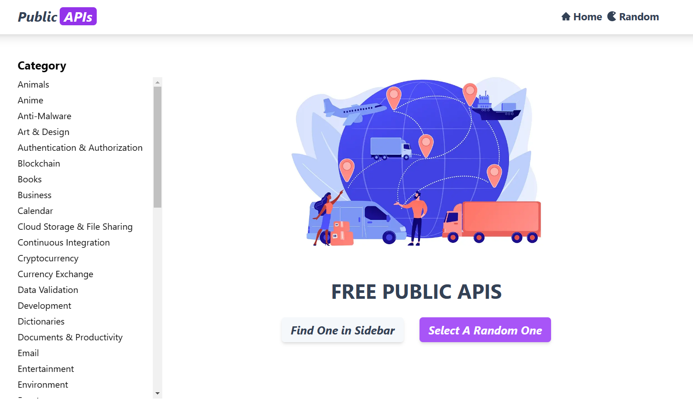

<h1>
  Public APIs Frontend
  
</h1>

This is a project for [Public APIs](https://github.com/public-apis/public-apis) Frontend Based on [NextJs 13](https://beta.nextjs.org/docs) blooded with app directory experimental feature.

> Demo link:
>
> - [https://beta.nextjs.org/docs](https://beta.nextjs.org/docs)
